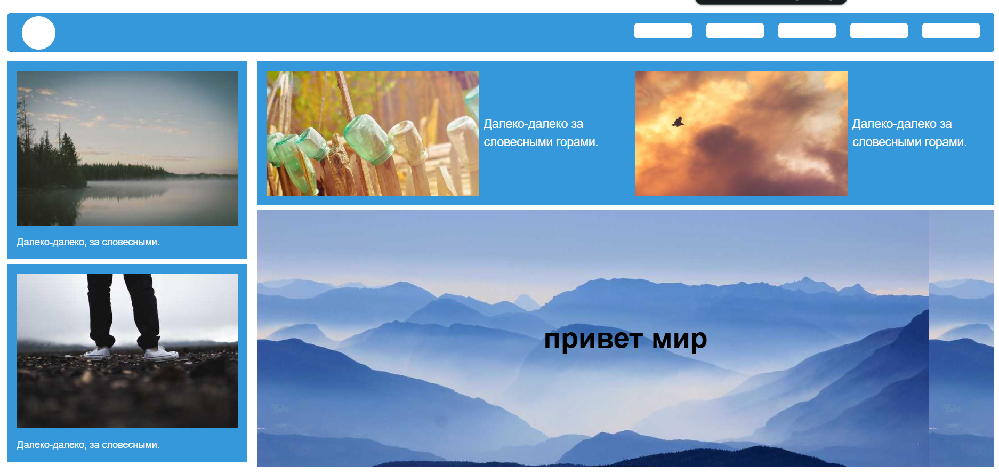

# 🌍 Учебный проект: практика с media-запросами

Этот проект является наброском сайта, созданным в рамках курса по веб-разработке.  
Основная цель — **закрепление навыков работы с CSS media-запросами** и создание адаптивной вёрстки.

## 📖 О проекте
- Используется **HTML + CSS**;
- Реализованы **разные сетки и расположения элементов** для разных размеров экрана;
- Отрабатываются ключевые приёмы адаптивного дизайна:
  - изменение структуры блоков;
  - перестроение сетки;
  - корректировка размеров текста и изображений.

## 🖼️ Скриншот

🎯 Цель проекта
Практика и закрепление работы с media-запросами для создания адаптивных веб-страниц.
